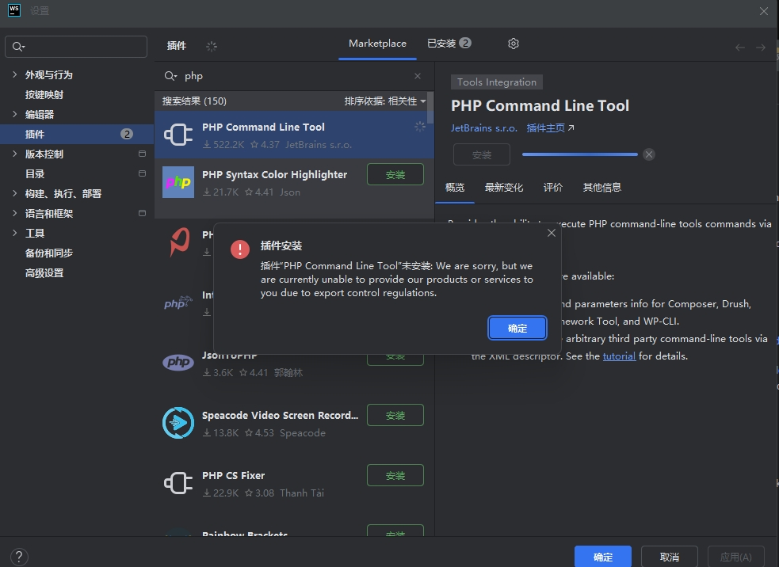
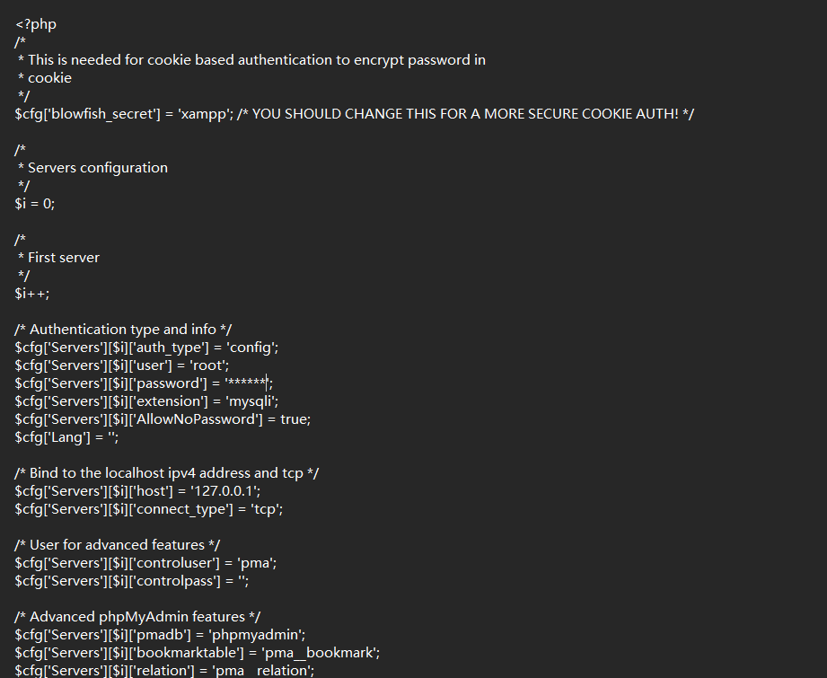
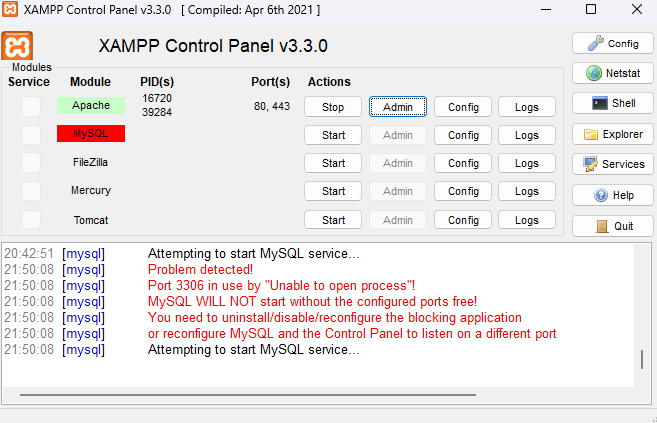
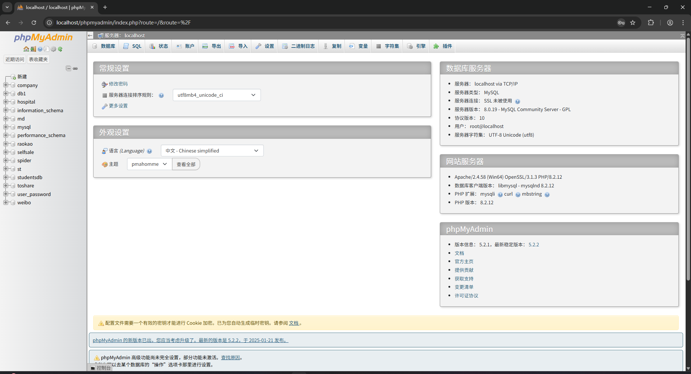

# 1. 简介

phpwcms是一个灵活、快速、强大且对客户和开发者友好的基于Web的内容管理系统（CMS）框架，运行在PHP和MySQL/MariaDB上。它由Oliver Georgi创建并维护。

- **官网**：[phpwcms.org](https://phpwcms.org/) 或 [phpwcms支持论坛](https://phpwcms.org/forum)
- **社区文档**：社区驱动的HowTo Wiki（快照）
- **问题解答**：大多数问题已在phpwcms支持论坛中得到解答。

### **快速开始**

- **稳定版本**：可以通过克隆仓库 `git clone git://github.com/slackero/phpwcms.git` 或下载归档文件来使用。
- **开发版本**：使用 `git clone -b v1.10-dev git://github.com/slackero/phpwcms.git` 或下载开发版本的归档文件。如果下载了归档文件，请解压并将其复制到Web文档根目录或子文件夹中，然后通过浏览器访问相关URL并按照安装说明操作。

### **升级**

- 在升级到v1.10+之前，请先更新到最新的v1.9.x版本。
- **备份**：升级前请务必备份数据库和文件。

### **服务器系统要求**

- **phpwcms版本1.10.8**：需要支持PHP 8.2或更高版本的Web服务器，以及MySQL/MariaDB数据库（最低版本5.6+或等效版本）。

### **已知问题**

- 由于项目历史原因，数据库可能存在一些问题。MySQL在过去几年中更改了与时间和日期相关的默认值。建议检查相关配置值以更兼容的方式连接到数据库。MySQL Strict模式不是一个好的选择。

### **Bug追踪**

- 如果发现Bug，请在GitHub上创建符合necolas指南的Issue。

### **分享**

- phpwcms已不再活跃于社交媒体。请使用phpwcms支持论坛或GitHub分享您的想法。

### **创建者**

- **Oliver Georgi**：[GitHub主页](https://github.com/slackero) | [个人网站](https://webverbund.de/)

### **版权和许可**

- **版权**：2002-2025年，Oliver Georgi
- **许可**：根据GNU通用公共许可证第2版（GPLv2）授权。您可以在[LICENSE文件](https://github.com/slackero/phpwcms/blob/master/LICENSE)或[GNU许可证官网](https://opensource.org/licenses/GPL-2.0)查看许可证详情。
- **自由软件**：您可以自由分发和/或修改此软件，但不提供任何形式的保证，包括适销性或特定用途的适用性保证。详情请参阅GNU通用公共许可证。

<!-- by 施国达 -->

# 2. 项目部署

要运行 **phpwcms** 项目我当然离不开配置环境啦！接下来就详细地讲解一下该如何配置环境吧！

**因为WebStorm是我们常用的前端软件，所以我们以WebStorm为基础去配置环境**

## ~~2.1 安装本地开发环境~~

### ~~2.1.1安装Web服务器~~

WebStorm 是一个强大的 PHP 开发工具，但它本身不包含 **Web 服务器**或数据库，因此我们需要配置本地开发环境来运行项目。

- 首先我们可以进入到这个网页：[XAMPP Installers and Downloads for Apache Friends](https://www.apachefriends.org/zh_cn/index.html)

去下载XAMPP，它包含了Apache、 Mysql、 PHP是一个非常值得推荐的开发环境

我们下载的**版本是8.2.12**版本（推荐8.2版本以上的）

- 下载安装web Storm

- 下载mysql（XAMPP自带mysql）

## ~~2.2 配置Web Storm~~

欸？这里发现了一个问题！我们的webstorm不支持下载

~~好的那么一切重来哈哈哈哈哈哈哈哈哈哈~~

##  2.1 安装本地开发环境

现在是基于vscode版本

- 配置PHP(环境变量)

~~~bash
php -v

PHP 8.2.12 (cli) (built: Oct 24 2023 21:15:15) (ZTS Visual C++ 2019 x64)
Copyright (c) The PHP Group
Zend Engine v4.2.12, Copyright (c) Zend Technologies
~~~

**此时命令行已经显示出版本号说明PHP环境ok**

- 配置mysql（网上自己下载去~）

~~~bash
(base) PS E:\phpwcms\phpwcms-master\phpwcms-master> MySQL -u root -p
Enter password: ******
Welcome to the MySQL monitor.  Commands end with ; or \g.
Your MySQL connection id is 10
Server version: 8.0.19 MySQL Community Server - GPL

Copyright (c) 2000, 2020, Oracle and/or its affiliates. All rights reserved.

Oracle is a registered trademark of Oracle Corporation and/or its
affiliates. Other names may be trademarks of their respective
owners.

Type 'help;' or '\h' for help. Type '\c' to clear the current input statement.
~~~

**说明mysql环境也没有问题可以正常登录**

- **安装 Composer**：

~~~bash
php -r "copy('https://getcomposer.org/installer', 'composer-setup.php');"
php composer-setup.php
php -r "unlink('composer-setup.php');"
~~~

输入以下命令（自己操作时注意路径，把文件放入到全局环境中）

~~~bash
mv composer.phar E:\phpwcms\xampp\php\composer
~~~

运行依赖

~~~bash
composer install
~~~

如果不行的话就是Composer安装有问题（一般都是因为**网络太差了**才这样，可以多试几次）

也可以重新安装

~~~bash
两张链接
首选
php -r "copy('https://getcomposer.org/installer', 'composer-setup.php');"
备选
php -r "copy('https://install.phpcomposer.com/installer', 'composer-setup.php');"
~~~

下载完可以输入以验证

~~~bash
php -r "if (hash_file('sha384', 'composer-setup.php') === 'your_correct_hash_value') { echo 'Installer verified'; } else { echo 'Installer corrupt'; unlink('composer-setup.php'); } echo PHP_EOL;"
~~~

运行

~~~bash
php composer-setup.php --install-dir=bin --filename=composer
~~~

验证安装

~~~bash
php bin\composer --version
~~~

**如果还是不行请检查你的项目是否放在xampp->htdocs中**

~~vscode麻烦的地方在于好多地方配置完都需要重新打开~~

<!-- by 叶倬禛 -->

## 2.2 配置数据库

进入到xampp->phpmyadmin->config.inc.php中，配置你的数据库信息

配置完成之后点击XAMPP中的admin

就能进入到登录页面，输入账号密码就可以进来了

这样就入到数据库里了~~~

- 检查MySql配置文件

进入到XAMPP->mysql->bin->my.ini中检查以下配置

~~~ini
[mysqld]
bind-address = 127.0.0.1
~~~

## 2.3 在vscode中打开项目

推荐安装以下 VSCode 扩展：

- **PHP Intelephense**：提供代码提示和智能感知。
- **PHP Debug**：用于调试 PHP 代码。
- **Live Server**：用于实时预览网页。

## 2.4  **运行项目**

1. **通过 XAMPP 访问项目**： 打开浏览器，访问 `http://localhost/phpwcms`。
   - 如果一切配置正确，你应该能看到 phpwcms 的安装向导页面。
   - 按照安装向导的提示完成安装，包括数据库配置、管理员账户创建等。
2. **使用 VSCode 的 Live Server**：
   - 在 VSCode 中，右键点击项目中的 `index.php` 文件，选择“Open with Live Server”。
   - Live Server 会自动启动一个本地服务器，并在浏览器中打开项目。

<!-- by 王梓宇 -->

# 3. 调试项目

如果需要**调试PHP代码**，可以配置Xdebug:

- 安装Xdebug

  编辑XAMPP->php->php.ini文件，添加以下配置

~~~ini
[Xdebug]
zend_extension="C:\xampp\php\ext\php_xdebug.dll"
xdebug.mode=debug
xdebug.start_with_request=yes
xdebug.client_host=127.0.0.1
xdebug.client_port=9003
~~~

（**配置后**一定要记得重启XAMPP的Apache模块）

- **配置VSC偶的的调试环境**

~~~txt
在 VSCode 中，点击左侧的“运行和调试”图标。
点击“创建 launch.json 文件”，选择“PHP”作为调试环境。
启动调试，VSCode 会自动连接到 Xdebug。
~~~

# 4. 总结与补充

1. **数据库连接问题**：

   ​		我们小组在初期连接数据库的时候发现数据库总是连不上，以为是本地的数据库冲突了。其实不是这个原因。

   ​		而是我们没有进入到正确的地方去配置环境

   - **正确的方法：**找到 `config.inc.php`这个文件，进去配置你本地的数据库账号密码。

   - **确保**数据库**已创建**，并且root用户有访问权限		

2. **Apache配置问题**：

   - 一定要确保某盘:/xampp/hodocs/phpwcms文件夹中存在index.php或者其他入口文件。
   - 检查httpd.conf文件，确保`DocumentRoot` 和 `Directory` 配置正确。

3.  **权限问题**：

   - 确保 XAMPP 的 Apache 服务有权限访问项目文件夹和文件。

4. **URL 路径问题**：

   - 确保访问的 URL 路径正确。

<!-- by 李双林 -->

# 5. Contributor Covenant Code of Conduct——参与者守则行为准则

## 5.1 Our Pledge —— 我们的承诺

~~~txt
In the interest of fostering an open and welcoming environment, we as contributors and maintainers pledge to making participation in our project and our community a harassment-free experience for everyone, regardless of age, body size, disability, ethnicity, gender identity and expression, level of experience, nationality, personal appearance, race, religion, or sexual identity and orientation.
~~~

为了营造一个开放和友好的环境，作为贡献者和维护者，我们承诺让参与我们的项目和社区的每个人都能获得一个没有骚扰的体验，无论年龄、体型、残疾、种族、性别认同和表达、经验水平、国籍、个人外貌、种族、宗教或性认同和取向。

## 5.2 Our Standards —— 我们的标准

~~~txt
Examples of behavior that contributes to creating a positive environment include:

Using welcoming and inclusive language
Being respectful of differing viewpoints and experiences
Gracefully accepting constructive criticism
Focusing on what is best for the community
Showing empathy towards other community members
Examples of unacceptable behavior by participants include:

The use of sexualized language or imagery and unwelcome sexual attention or advances
Trolling, insulting/derogatory comments, and personal or political attacks
Public or private harassment
Publishing others' private information, such as a physical or electronic address, without explicit permission
Other conduct which could reasonably be considered inappropriate in a professional setting
~~~

有助于创造积极环境的行为包括：

使用欢迎和包容的语言
尊重不同的观点和经验
优雅地接受建设性的批评
专注于什么是对社区最好的
对其他社区成员表示同情
参与者不可接受的行为包括：

使用带有性色彩的语言或意象，以及不受欢迎的性关注或性挑逗
挑衅，侮辱/贬损的评论，以及个人或政治攻击
公开或私下骚扰
未经明确许可，发布他人的私人信息，如物理或电子地址
其他在专业环境中被合理认为不适当的行为

<!-- by 陆文财 -->

## 5.3 Our Responsibilities —— 我们的责任

~~~txt
Project maintainers are responsible for clarifying the standards of acceptable behavior and are expected to take appropriate and fair corrective action in response to any instances of unacceptable behavior.

Project maintainers have the right and responsibility to remove, edit, or reject comments, commits, code, wiki edits, issues, and other contributions that are not aligned to this Code of Conduct, or to ban temporarily or permanently any contributor for other behaviors that they deem inappropriate, threatening, offensive, or harmful.
~~~

项目维护者有责任澄清可接受行为的标准，并期望对任何不可接受的行为采取适当和公平的纠正措施。

项目维护者有权利和责任删除、编辑或拒绝与本行为准则不一致的评论、提交、代码、维基编辑、问题和其他贡献，或者暂时或永久禁止他们认为不适当、威胁、冒犯或有害的其他行为的任何贡献者。

## 5.4 Scope —— 范围

~~~txt
This Code of Conduct applies both within project spaces and in public spaces when an individual is representing the project or its community. Examples of representing a project or community include using an official project e-mail address, posting via an official social media account, or acting as an appointed representative at an online or offline event. Representation of a project may be further defined and clarified by project maintainers.
~~~

本行为准则既适用于项目空间，也适用于个人代表项目或社区的公共空间。代表项目或社区的例子包括使用官方项目电子邮件地址，通过官方社交媒体帐户发帖，或在在线或离线活动中担任指定代表。项目维护者可以进一步定义和澄清项目的表示。

## 5.5 Enforcement —— 执行

~~~txt
Instances of abusive, harassing, or otherwise unacceptable behavior may be reported by contacting the project team at slackero+github@gmail.com. The project team will review and investigate all complaints, and will respond in a way that it deems appropriate to the circumstances. The project team is obligated to maintain confidentiality with regard to the reporter of an incident. Further details of specific enforcement policies may be posted separately.

Project maintainers who do not follow or enforce the Code of Conduct in good faith may face temporary or permanent repercussions as determined by other members of the project's leadership.
~~~

辱骂、骚扰或其他不可接受的行为可以通过联系项目团队在slackero+github@gmail.com报告。项目团队将审查和调查所有投诉，并将以其认为适当的方式对情况作出回应。项目团队有义务对事件的报告人保密。具体执行政策的进一步细节可另行公布。

项目维护者如果不真诚地遵循或执行行为准则，可能会面临由项目领导的其他成员决定的暂时或永久的后果。

<!-- by 杨昌福 -->